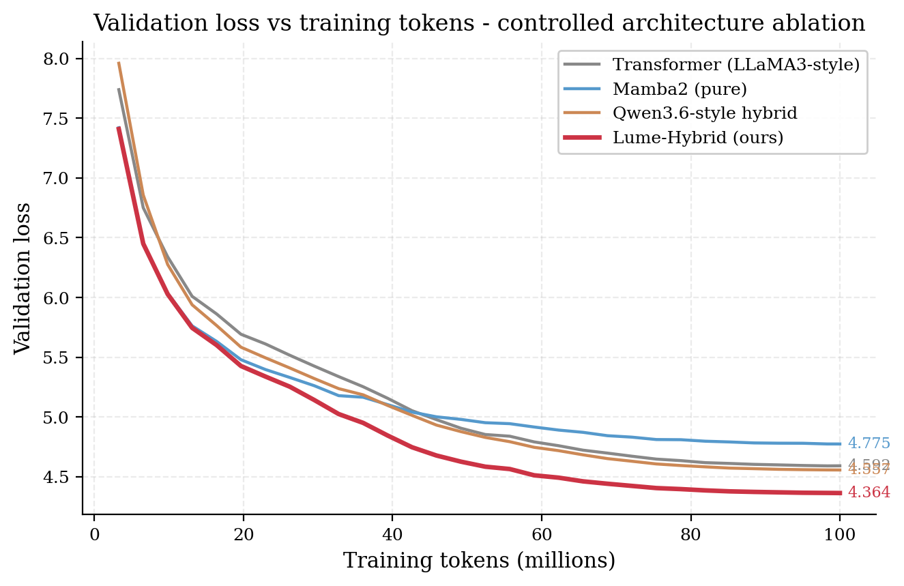
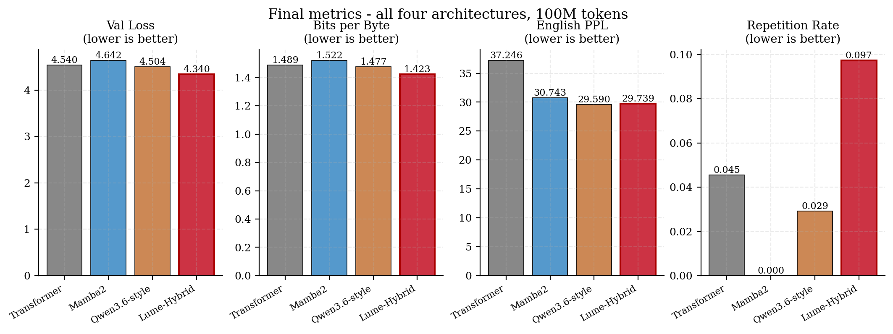

# Lume-Hybrid

A 390M-parameter language model with a Mamba2 + Differential Attention hybrid architecture.

Trained on 30B tokens of FineWeb-Edu. The architecture is validated by a controlled ablation showing it outperforms transformer, pure Mamba2, and Qwen3.6-style hybrid baselines at matched parameters.

This is a research codebase. **No pretrained weights are released — train from source.**

[](LICENSE)

## Architecture

Lume-Hybrid alternates two layer types:

- **Mamba2** layers (even-indexed: 0, 2, 4, ...) — selective state-space mixer with linear scaling and strong early-training convergence
- **Differential Attention** layers (odd-indexed: 1, 3, 5, ...) — two softmax-attention paths whose difference suppresses attention noise (Ye et al., 2024)

24 layers total: 12 Mamba2 + 12 Differential Attention, alternating every layer. SwiGLU FFN, RMSNorm pre-norm, RoPE on attention layers, tied embeddings.

| Property | Value |
|---|---|
| Parameters | 390.7M |
| Layers | 24 (12 Mamba2 + 12 DiffAttn) |
| Hidden dim | 896 |
| Heads | 14 (head_dim 64) |
| FFN | SwiGLU, hidden 2432 |
| Mamba state dim | 128 |
| Tokenizer | Llama-3.2 (128256 vocab) |
| Context length | 3072 |
| Training tokens | ~30B (FineWeb-Edu mix) |

See [`docs/ARCHITECTURE.md`](docs/ARCHITECTURE.md) for full details.

## Ablation Evidence

A controlled comparison at matched ~114M parameters and 100M tokens of FineWeb-Edu, identical hyperparameters, shared pre-tokenized data:

| Architecture    | Val Loss   | BPB       |
|-----------------|------------|-----------|
| transformer     | 4.5404     | 1.489     |
| mamba2          | 4.6420     | 1.522     |
| qwen36          | 4.5037     | 1.477     |
| **lume_hybrid** | **4.3400** | **1.423** |

Lume-Hybrid wins by 0.164 loss units over the runner-up (qwen36) — well above the ~0.05 noise threshold at this scale.



*Validation loss across training. Lume-Hybrid (red) leads from early in training onward; the gap grows with compute, indicating real architectural advantage rather than initialization noise.*



*Final metrics at 100M tokens. Lume-Hybrid wins on val loss, BPB, and English PPL; pure Mamba2 wins on repetition rate (a known SSM strength at small scale).*

Full methodology, caveats, and reproduction instructions in [`ablation/`](ablation/). To regenerate the figures from the raw history JSONs:

```bash
python ablation/plot_results.py
```

## Repository Layout

```
lume-hybrid/
├── modeling.py                # LumeConfig, LumeModel, LumeBlock, DifferentialAttention,
│                              # MambaWrapper, SwiGLU, RMSNorm, RoPE helpers
├── data.py                    # Streaming dataset loader (interleaved HF datasets)
├── train.py                   # CLI: train / tune / chat
├── inference.py               # Cached generation (KV cache for DiffAttn + Mamba history)
├── evaluate.py                # Multi-domain perplexity + sample comparison vs Pythia baselines
├── ablation/
│   ├── train_ablation.py      # Controlled 4-way ablation at ~114M params, 100M tokens
│   ├── plot_results.py        # Generate figures from history JSONs
│   ├── results.json           # Final ablation metrics
│   ├── README.md              # Methodology + caveats
│   ├── history/               # Per-arch training histories (one JSON per arch)
│   └── figures/               # Generated PNG plots
├── examples/
│   ├── load_and_generate.py   # Load locally-trained weights and generate text
│   └── reproduce_eval.py      # Run the evaluation suite end-to-end
├── docs/
│   ├── ARCHITECTURE.md        # Full architectural detail
│   └── EVALUATION.md          # Eval methodology and BPB normalization
├── results/
│   ├── perplexity.json        # Per-domain BPB results
│   ├── samples.json           # Generation samples
│   └── benchmarks.json        # Inference benchmarks (cached vs naive)
├── requirements.txt
├── CITATION.cff
└── LICENSE                    # Apache 2.0
```

## Training

This is a from-scratch pretraining setup. Expect days-to-weeks of GPU time depending on scale.

```bash
git clone https://github.com/Harp404/lume-hybrid.git
cd lume-hybrid
pip install -r requirements.txt

# Pretrain Lume-Hybrid (~30B tokens at the default config)
python train.py train --path lume_hybrid.safetensors

# Resume from the latest checkpoint (auto-detected via lume_step_*.safetensors)
python train.py train --path lume_hybrid.safetensors

# Optional: light fine-tune on UltraChat
python train.py tune --path lume_hybrid.safetensors

# Interactive chat against a trained checkpoint
python train.py chat --path lume_hybrid.safetensors
```

The default config (24 layers, dim 896, seq_len 3072, batch 2 × 128 grad-accum) targets ~50K steps and produces `lume_hybrid.safetensors` plus `lume_step_{N}.safetensors` rolling checkpoints alongside `training_state.pt` for resume.

To run the architecture ablation at smaller scale:

```bash
python ablation/train_ablation.py --arch all --tokens 100_000_000
```

## Inference

For cached generation (KV cache on DiffAttn layers, history accumulation on Mamba2 layers), use `inference.py`. See [`examples/load_and_generate.py`](examples/load_and_generate.py) for a minimal driver script that loads a local checkpoint and generates text.

## Limitations

- Research codebase, not a production model.
- Trained on 30B tokens — undertrained relative to modern LLMs. Factual recall is unreliable; multi-step reasoning typically fails.
- No pretrained weights released — train from source.
- No instruction tuning, no RLHF, no safety alignment. Base model only.
- Small-scale; performance at larger scale is unknown.
- Premature EOS on code completions at low temperatures (training-data artifact). Use `temperature ≥ 0.7` for code generation.

## License

Apache 2.0. See [LICENSE](LICENSE).

## Citation

```bibtex
@software{lume_hybrid_2026,
  title  = {Lume-Hybrid: A Mamba2 + Differential Attention Hybrid Language Model},
  author = {Singh, Harpreet},
  year   = {2026},
  url    = {https://github.com/Harp404/lume-hybrid},
  note   = {Independent research release}
}
```

Related work this is built on:

- Dao, T., & Gu, A. (2024). *Transformers are SSMs: Generalized Models and Efficient Algorithms Through Structured State Space Duality.*
- Ye, T., et al. (2024). *Differential Transformer.*
- Biderman, S., et al. (2023). *Pythia: A Suite for Analyzing Large Language Models Across Training and Scaling.*

## Acknowledgments

Independent research. No corporate or institutional affiliation. Trained on personal compute.
